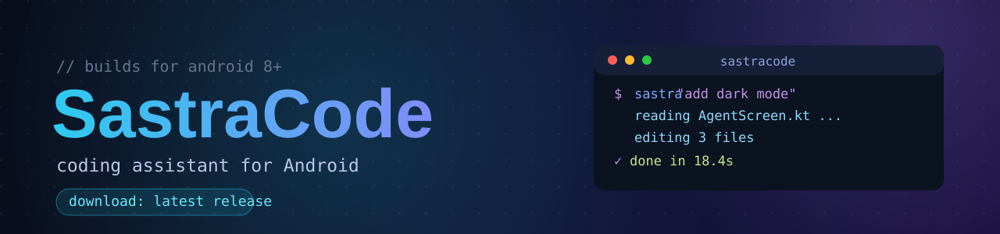

  

  Ready-to-install releases of <b>SastraCode</b>, a coding assistant for Android. It works on your
  phone, against your projects: reading and editing code, running shell commands, searching the web,
  and carrying out long tasks in the background.

  
  
  

The application source is private and not published here. Every release here is built automatically
from the source repository: when code lands there, the newest APK appears here. Older releases are
removed, so only the latest stays available.

---

## Install

1. Open the [latest release](https://github.com/vikas0vks/sastracode-builds/releases/latest) and
   download the APK.
2. Allow installation from unknown sources when prompted (the system prompt shown by the downloader,
   or Settings, Security).
3. Open the APK and install.

SastraCode is sideload-only and is not distributed through an application store.

## What is inside

- A chat agent that reads, writes, and edits files in your workspace
- A sandboxed shell runtime (Termux-backed, no root required)
- Live streaming of reasoning, replies, code writes, and command output
- Tool management from the chat with `/` commands (MCP servers, SSH hosts, skills, automations)
- Scheduled tasks that run even when the app is closed
- Context metering and compaction for long sessions
- Bring-your-own model endpoints (OpenAI-compatible or Anthropic-compatible, plus local servers such
  as Ollama that need no key)

## First run

Open a project folder, choose a model endpoint in Settings, and ask for a task.

---

<em>Released by vikas0vks. Files are provided for personal use.</em>

